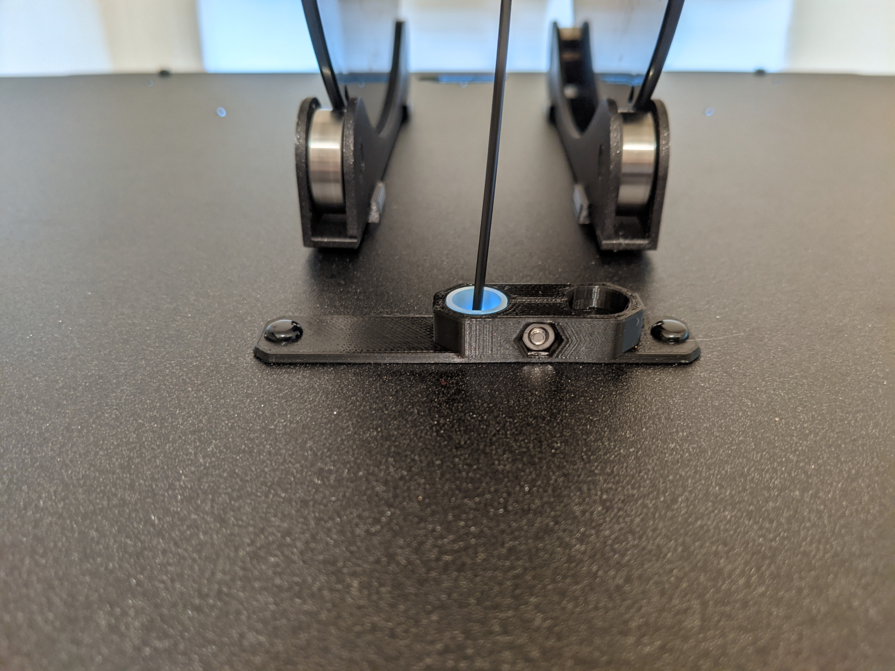

For printing TPU on the MK4, with the load cell, I wanted the filament path to be as smooth and straight as possible. I plan to use a roller bearing spool holder on top of my Prusa Enclosure and to skip the bowden tube.

This model accepts the filament guide PTFE tube from the MK4 and secures it using a M3 screw and nut, same as the original.

This print uses the following parts from one side of the filament guide (leaving the other side intact for continued use with the lid open, or on another printer):

    Filament guide PTFE tube (1x)
    M3n nut (1x)
    M3x10 screw (1x)
    Nylon rivet (2x)

[Assembly instructions match those of the filament guide](https://help.prusa3d.com/guide/7-y-carriage-heatbed-assembly_438310#440120).

The *enclosure-top-filament-guide.stl* version prints as-is, but does not plug the top center hole, only covers it. The *enclosure-top-filament-guide-needs-supports.stl* retains most of the plug but must be printed with (organic) supports.

The guide/cover is held in place by nylon rivets, [as shown in the enclosure assembly guide](https://help.prusa3d.com/guide/6-hinged-lid-add-on_354154#354289).

This is a remix of [the Prusa MK4 filament guide](https://www.printables.com/model/434911-filament-guide) and the [Prusa Enclosure]() from Prusa, the source *.stl*s belong to them.
